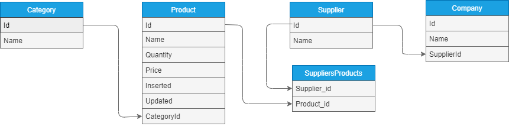

# Aspnetcore-NHibernate
POC para testar o ORM Nhibernate para o AspnetCore versão 3.1

### ☕ Features
* Mapeamento objeto relacional para as cardinalidades 1x1, 1xN e NxN
* Utilização do Fluent Nhibernate, para mapeamento via codificação
* Schema do banco de dados com criação e update automático, utilizando SQLite

### Database Schema 

  
  
  
### Frameworks

  
  
  
  
 
 
### Database

